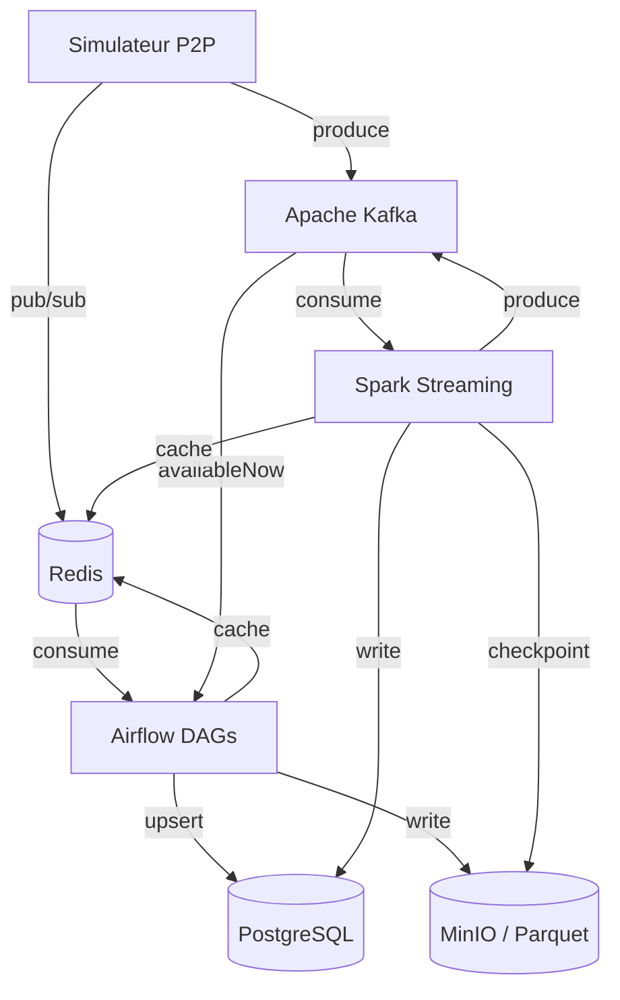

# Architecture SPOTIFY

> Architecture du groupe — pipeline data Spotify-like (P2P + batch + streaming).
> Le modèle de données détaillé est documenté dans [`DATA_MODEL.md`](./DATA_MODEL.md).

---

## Vision d'ensemble

Architecture **Lambda** : un simulateur P2P produit des événements, consommés en parallèle par une
couche **batch** (Airflow → PostgreSQL/MinIO) et une couche **vitesse** (Spark Streaming → PostgreSQL/Redis).



---

## Décisions architecturales

### ETL vs ELT — Mapping par pipeline

| Pipeline | Approche | Justification |
|----------|----------|---------------|
| `catalog_ingestion` | **ETL** | Référentiel petit et structuré : on **transforme/valide/normalise** (déduplication, normalisation des genres, contrôle des FK artiste/album) **avant** de charger dans les tables relationnelles. Schema-on-write. |
| `streaming_events` | **ELT** | Très gros volume : on **charge d'abord** les événements bruts (PostgreSQL `listening_events` + Parquet sur MinIO), la transformation se fait en aval. *Land raw first, transform later* — on ne veut rien perdre à l'ingestion. |
| `aggregation` | **ELT** | Lit des données **déjà chargées** (events bruts) et les transforme en agrégats (`daily_streams`, `artist_stats`) ; la transformation s'exécute *in-warehouse* (SQL / Spark sur la donnée déjà présente). |
| `streaming_trends` (Spark) | **ETL (streaming)** | Transformation **à la volée** (agrégation fenêtrée 5 min) **dans le flux**, avant écriture dans `realtime_top_tracks`. *Transform-in-flight* : seul le résultat agrégé est matérialisé. |

### Partitionnement Parquet

Expliquer ici votre stratégie de partitionnement des fichiers Parquet sur MinIO.

```
spotify-parquet/
└── listening_events/
    └── date=2025-01-15/
        └── hour=14/
            └── part-00000.parquet
```

**Pourquoi cette structure ?**
- **Partition pruning** : les requêtes filtrées par jour/heure ne lisent que les répertoires
  concernés au lieu de scanner tout le dataset.
- **Parallélisation** : un fichier par (date, heure) → Spark/Airflow traitent les partitions en
  parallèle, fichiers de taille homogène (évite les *small files*).
- **Cohérence avec PostgreSQL** : ce découpage horaire calque l'index sur expression
  `date_trunc('hour', timestamp)` de `listening_events` (cf. [`DATA_MODEL.md`](./DATA_MODEL.md#q1)).
- **Idempotence** : un re-run d'une heure réécrit uniquement la partition correspondante.

### Topics Kafka — Stratégie de partitionnement

| Topic | Partitions | Clé | Justification |
|-------|-----------|-----|---------------|
| listening_events | 6 | user_id | Gros volume → 6 partitions pour le parallélisme ; clé `user_id` = ordre par utilisateur + co-localisation pour la détection de fraude. |
| p2p_network_events | 6 | peer_id | Trafic réseau dense ; clé `peer_id` groupe les transferts d'un même pair sur une partition (suivi de session P2P, latences). |
| catalog_updates | 3 | track_id | Faible volume (référentiel) → 3 partitions suffisent ; clé `track_id` garantit l'ordre des mises à jour d'un même titre. |
| fraud_alerts | 3 | user_id | Volume modéré ; clé `user_id` regroupe toutes les alertes d'un utilisateur pour un traitement cohérent en aval. |

**Pourquoi `user_id` comme clé pour `listening_events` ?**
- Tous les événements d'un même utilisateur arrivent sur **la même partition** → **ordre garanti
  par user** (essentiel pour reconstituer une session d'écoute).
- La **détection de fraude** raisonne par utilisateur (bursts, bot streams) : co-localiser ses
  events sur une partition évite les *shuffles* coûteux côté Spark.
- Bonne **répartition de charge** : un grand nombre d'utilisateurs distribue uniformément le trafic
  sur les 6 partitions, sans *hot partition* (contrairement à une clé `track_id` où un titre viral
  saturerait une partition).

---

## Choix techniques

### Pourquoi CeleryExecutor (pas KubernetesExecutor) ?

- **Pas de cluster Kubernetes requis** : tout tourne en local via `docker-compose`, le
  KubernetesExecutor imposerait un cluster k8s (overhead inutile pour un TP).
- **Scaling horizontal suffisant** : on ajoute des workers Celery (`airflow-worker`) pour absorber
  la charge, sans la latence de création/destruction d'un pod par tâche.
- **Mise en route simple** : un broker (Redis) + des workers, déjà présents dans la stack.
- KubernetesExecutor resterait le bon choix en production cloud (isolation par tâche, scaling à zéro).

### Gestion des secrets

- Les credentials (`POSTGRES_PASSWORD`, clés MinIO, etc.) vivent dans un fichier **`.env`
  non versionné** (présent dans `.gitignore`) ; un **`.env.example`** documente les variables sans
  les valeurs réelles.
- `docker-compose.yml` injecte ces variables comme **variables d'environnement** dans les services.
- Côté Airflow, les accès externes passent par des **Connections / Variables** plutôt que d'être
  codés en dur dans les DAGs.

---

## Architecture Lambda — Batch + Speed Layer

```
Speed layer  : Simulateur → Kafka → Spark → PostgreSQL (realtime_*) + Redis
Batch layer  : Simulateur → Kafka (availableNow) → Airflow → PostgreSQL (daily_*) + MinIO
Serving layer: PostgreSQL + Redis ← consommé par les clients
```

**Ce qui est en batch et pourquoi :**
- Agrégats journaliers (`daily_streams`, `artist_stats`), recommandations, retraitement DLQ.
- Pourquoi : on privilégie l'**exactitude et la complétude** sur des fenêtres larges ; ces résultats
  sont **recalculables et idempotents** (source de vérité), la latence (heures) est acceptable.

**Ce qui est en streaming et pourquoi :**
- Top tracks par fenêtre 5 min (`realtime_top_tracks`), détection de fraude (`fraud_detections`).
- Pourquoi : on privilégie la **fraîcheur** — dashboards live, alertes — quitte à accepter une
  donnée approximative/éphémère qui sera, si besoin, corrigée par la couche batch.

---

## Schémas d'événements

### listening_event

```json
{
  "event_id":    "uuid",
  "user_id":     "uuid",
  "track_id":    "uuid",
  "source_peer": "uuid",
  "timestamp":   "2025-01-15T14:30:00Z",
  "duration_ms": 45000,
  "device_type": "mobile",
  "geo_country": "FR",
  "completed":   true,
  "event_source": "p2p"
}
```

### p2p_network_event

```json
{
  "event_id":   "uuid",
  "event_type": "chunk_transfer",
  "peer_id":    "uuid",
  "target_peer": "uuid",
  "track_id":   "uuid",
  "chunk_size_bytes": 65536,
  "latency_ms": 12,
  "timestamp":  "2025-01-15T14:30:01Z"
}
```

---

## Leçons apprises

> À compléter au fur et à mesure de la semaine.

- **Lundi** : mise en place du schéma PostgreSQL et du modèle de données (issue #2). Points clés
  retenus : double index sur `listening_events` (temporel brut vs *bucket* horaire), séparation
  batch/streaming des agrégats (`daily_streams` vs `realtime_top_tracks`), choix de `JSONB` pour la
  DLQ afin de garder le payload requêtable. Voir [`DATA_MODEL.md`](./DATA_MODEL.md).
- **Mardi** : ...
- **Mercredi** : ...
- **Jeudi** : ...
- **Vendredi** : ...
