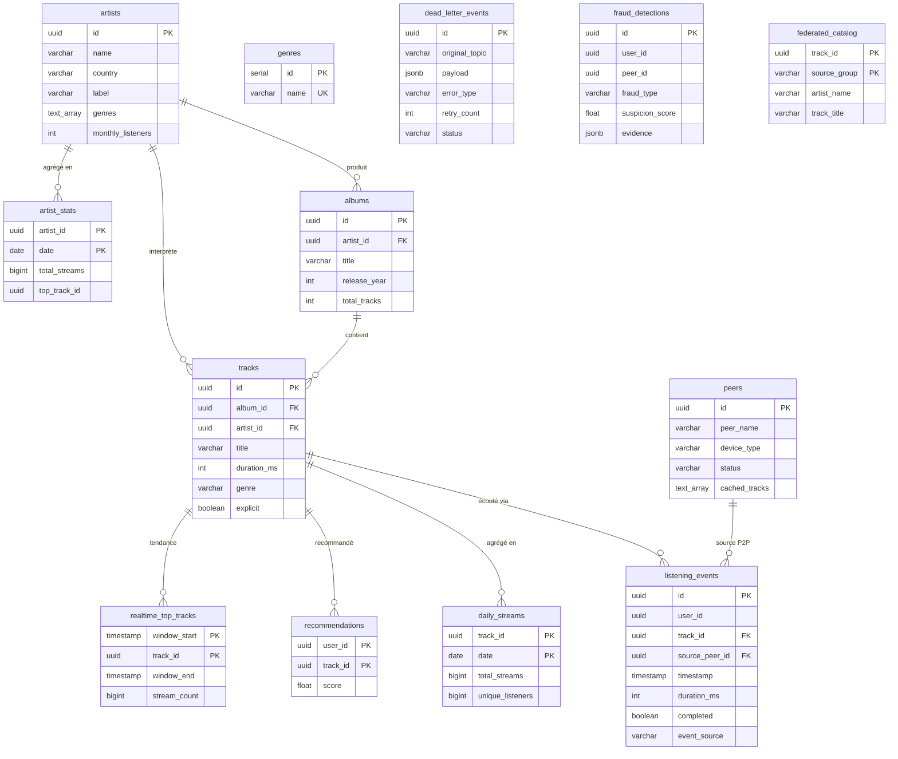

# Modèle de données SPOTIFY

> Documentation du schéma PostgreSQL défini dans [`sql/init_spotify_db.sql`](../sql/init_spotify_db.sql).
> Issue : **#2 — Schéma PostgreSQL et modèle de données SPOTIFY** (phase-1 / database).

---

## 1. Inventaire des tables

13 tables réparties en 6 modules. ✅ = présente avec ses index dans `init_spotify_db.sql`.

| Module | Table | Clé primaire | Index complémentaires |
|--------|-------|--------------|------------------------|
| **Catalogue** | `genres` | `id` (SERIAL) | `name` UNIQUE |
| | `artists` | `id` (UUID) | `UNIQUE(name, label)` |
| | `albums` | `id` (UUID) | FK `artist_id` |
| | `tracks` | `id` (UUID) | FK `album_id`, `artist_id` |
| **Réseau P2P** | `peers` | `id` (UUID) | — |
| **Événements** | `listening_events` | `id` (UUID) | `user_id`, `track_id`, `timestamp`, **`date_trunc('hour', timestamp)`** |
| **Agrégats batch** | `daily_streams` | `(track_id, date)` | — |
| | `artist_stats` | `(artist_id, date)` | — |
| | `recommendations` | `(user_id, track_id)` | — |
| **Dead Letter Queue** | `dead_letter_events` | `id` (UUID) | `status`, `created_at` |
| **Temps réel (Spark)** | `realtime_top_tracks` | `(window_start, track_id)` | — |
| | `fraud_detections` | `id` (UUID) | — |
| **Inter-groupes** | `federated_catalog` | `(track_id, source_group)` | — |

**Relations (clés étrangères déclarées)**
- `albums.artist_id → artists.id`
- `tracks.album_id → albums.id`, `tracks.artist_id → artists.id`
- `listening_events.track_id → tracks.id`, `listening_events.source_peer_id → peers.id`
- `daily_streams.track_id → tracks.id`
- `artist_stats.artist_id → artists.id`
- `recommendations.track_id → tracks.id`
- `realtime_top_tracks.track_id → tracks.id`

> `dead_letter_events`, `fraud_detections` et `federated_catalog` ne déclarent **pas** de FK : elles
> référencent des UUID *logiques* (events bruts / inter-groupes) qui peuvent ne pas exister localement,
> d'où l'absence volontaire de contrainte d'intégrité référentielle.

---

## 2. Diagramme entité-association (ERD)

Rendu automatiquement sur GitHub.



> `dead_letter_events`, `fraud_detections` et `federated_catalog` apparaissent sans relation : tables
> autonomes (cf. note §1 sur l'absence de FK).

---

## 3. Source dbdiagram.io (DBML)

À coller sur [dbdiagram.io](https://dbdiagram.io) pour générer/exporter un schéma image type draw.io.

```dbml
Table genres {
  id int [pk, increment]
  name varchar [not null, unique]
  created_at timestamp
}

Table artists {
  id uuid [pk]
  name varchar [not null]
  country varchar
  label varchar
  genres "text[]"
  monthly_listeners int
  created_at timestamp
  updated_at timestamp
  Indexes { (name, label) [unique] }
}

Table albums {
  id uuid [pk]
  artist_id uuid [not null, ref: > artists.id]
  title varchar [not null]
  release_year int
  total_tracks int
  created_at timestamp
}

Table tracks {
  id uuid [pk]
  album_id uuid [ref: > albums.id]
  artist_id uuid [not null, ref: > artists.id]
  title varchar [not null]
  duration_ms int [not null]
  genre varchar
  bpm int
  explicit boolean
  audio_file_path varchar
}

Table peers {
  id uuid [pk]
  peer_name varchar [not null]
  ip_address varchar
  device_type varchar
  geo_country varchar
  geo_city varchar
  status varchar
  cached_tracks "text[]"
  last_seen timestamp
}

Table listening_events {
  id uuid [pk]
  user_id uuid [not null]
  track_id uuid [not null, ref: > tracks.id]
  source_peer_id uuid [ref: > peers.id]
  timestamp timestamp [not null]
  duration_ms int
  device_type varchar
  geo_country varchar
  completed boolean
  event_source varchar
  Indexes {
    user_id
    track_id
    timestamp
    `date_trunc('hour', timestamp)` [name: 'idx_listening_events_ts_partition']
  }
}

Table daily_streams {
  track_id uuid [not null, ref: > tracks.id]
  date date [not null]
  total_streams bigint
  unique_listeners bigint
  total_duration_ms bigint
  countries "text[]"
  updated_at timestamp
  Indexes { (track_id, date) [pk] }
}

Table artist_stats {
  artist_id uuid [not null, ref: > artists.id]
  date date [not null]
  total_streams bigint
  unique_listeners bigint
  top_track_id uuid
  updated_at timestamp
  Indexes { (artist_id, date) [pk] }
}

Table recommendations {
  user_id uuid [not null]
  track_id uuid [not null, ref: > tracks.id]
  score float [not null]
  generated_at timestamp
  Indexes { (user_id, track_id) [pk] }
}

Table dead_letter_events {
  id uuid [pk]
  original_topic varchar
  payload jsonb [not null]
  error_type varchar
  error_message text
  retry_count int
  status varchar
  created_at timestamp
  last_retry_at timestamp
  resolved_at timestamp
  Indexes { status; created_at }
}

Table realtime_top_tracks {
  window_start timestamp [not null]
  window_end timestamp [not null]
  track_id uuid [not null, ref: > tracks.id]
  stream_count bigint
  unique_listeners bigint
  updated_at timestamp
  Indexes { (window_start, track_id) [pk] }
}

Table fraud_detections {
  id uuid [pk]
  user_id uuid
  peer_id uuid
  fraud_type varchar
  suspicion_score float
  evidence jsonb
  window_start timestamp
  window_end timestamp
  detected_at timestamp
}

Table federated_catalog {
  track_id uuid [not null]
  source_group varchar [not null]
  artist_name varchar
  track_title varchar
  duration_ms int
  genre varchar
  audio_peer_endpoint varchar
  ingested_at timestamp
  Indexes { (track_id, source_group) [pk] }
}
```

---

## 4. Réponses aux questions de l'issue

### Q1 — Pourquoi `listening_events` est indexé sur `(timestamp)` **ET** `date_trunc('hour', timestamp)` ?

Ce sont **deux index pour deux usages différents**, non redondants :

- **`idx_listening_events_timestamp` sur `(timestamp)`** — index B-tree classique. Il sert les
  requêtes de **plage ou de point sur l'horodatage brut** et les tris : « événements entre 14:00 et
  15:00 », « les N derniers événements » (`ORDER BY timestamp DESC`), bornes temporelles d'un job.

- **`idx_listening_events_ts_partition` sur `date_trunc('hour', timestamp)`** — **index sur
  expression**. PostgreSQL ne peut utiliser un index pour une expression *que* s'il existe un index
  portant sur **exactement cette expression**. Un index sur `timestamp` brut **ne peut pas** accélérer
  `WHERE date_trunc('hour', timestamp) = '...'` ni `GROUP BY date_trunc('hour', timestamp)`.

Cet index horaire sert les **agrégations par tranche d'une heure** (job batch Airflow
`aggregation_pipeline`) et **calque le partitionnement Parquet par heure** sur MinIO
(`date=YYYY-MM-DD/hour=HH/`). On garde donc les deux : l'un pour les scans temporels bruts, l'autre
pour le *bucketing* horaire des agrégats.

### Q2 — Qu'est-ce qui distingue `daily_streams` (batch) de `realtime_top_tracks` (Spark) ?

Les deux tables stockent des compteurs de streams mais appartiennent à **deux couches différentes de
l'architecture Lambda** :

| Axe | `daily_streams` — **couche batch** | `realtime_top_tracks` — **couche vitesse** |
|-----|------------------------------------|--------------------------------------------|
| Producteur | Airflow (DAG `aggregation_pipeline`) | Spark Structured Streaming (`streaming_trends_job`) |
| Déclenchement | planifié, 1× / jour | flux continu (micro-batches) |
| Granularité | par **jour** — PK `(track_id, date)` | fenêtre glissante de **5 min** — PK `(window_start, track_id)` |
| Latence | élevée (heures) | basse (quasi temps réel) |
| Exactitude | **complet & idempotent** : recalculable sur tout le jour, source de vérité historique | **approximatif / éphémère** : « ce qui est *hot* maintenant » |
| Rôle métier | reporting, historique, facturation | dashboards live, tendances instantanées |

En résumé : `daily_streams` privilégie l'**exactitude et la complétude** (latence acceptée),
`realtime_top_tracks` privilégie la **fraîcheur** (précision/durabilité moindres).

### Q3 — Pourquoi `dead_letter_events.payload` est stocké en `JSONB` plutôt qu'en `TEXT` ?

Le `payload` est un **événement échoué** dont le **schéma varie** selon la source (`redis_pub_sub`,
`kafka_topic`…). Le rôle de la Dead Letter Queue est d'**auditer, inspecter et rejouer** ces messages.

- **`JSONB`** stocke le JSON sous forme **binaire structurée, requêtable et indexable** :
  - on peut requêter *à l'intérieur* du payload (`payload->>'user_id'`, `payload @> '{...}'`) ;
  - on peut poser un **index GIN** pour filtrer efficacement les events défectueux ;
  - PostgreSQL **valide** à l'insertion que le contenu est un JSON bien formé ;
  - le **retraitement** (DAG `dlq_reprocessing_pipeline`) lit des champs typés sans re-parser une chaîne.
- **`TEXT`** serait un **blob opaque** : aucune validation, aucune requête sur le contenu, parsing
  applicatif obligatoire à chaque lecture.

**Compromis assumé** : `JSONB` coûte un peu plus cher à l'écriture (parsing/normalisation à l'insert)
et ne préserve pas l'ordre des clés ni les doublons — sans importance ici, où la **requêtabilité** prime.

---

## 5. Vérifier que le schéma est bien appliqué

```bash
docker compose up -d postgres
docker compose exec postgres psql -U spotify -d spotify -c "\dt"   # 13 tables
docker compose exec postgres psql -U spotify -d spotify -c "\di"   # index (dont les 4 de listening_events)
```
